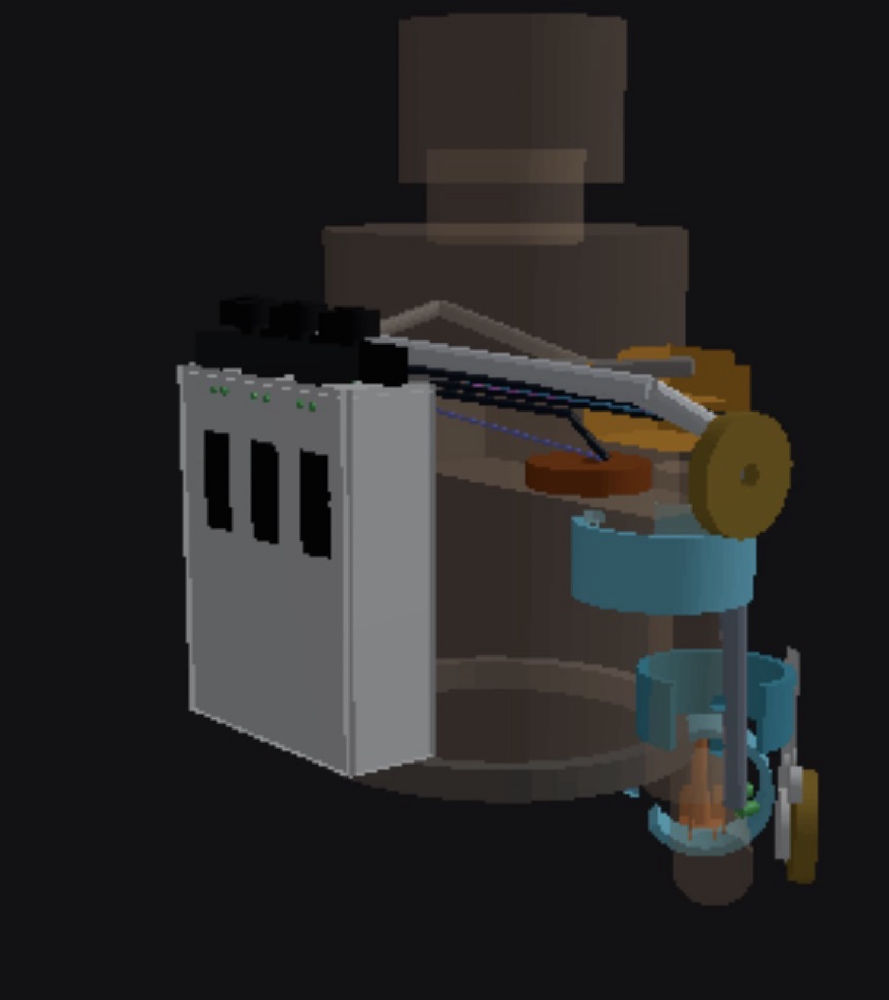
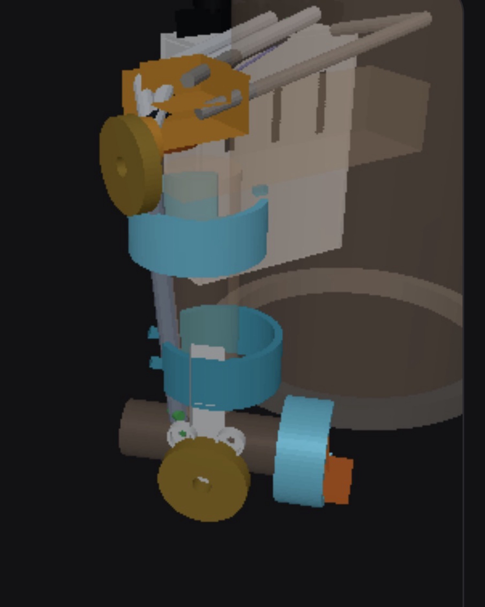
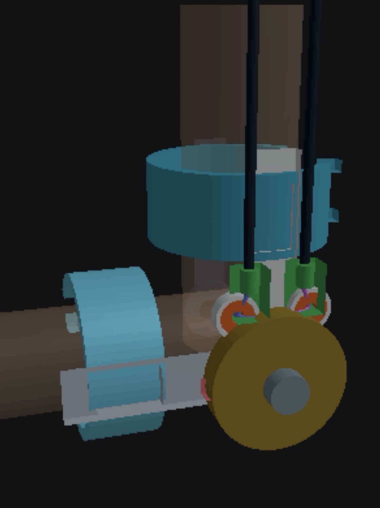

## CAD models

Printable plates and cuffs, McMaster sheaves/bearings, pack winches. Open **Build** on the site and tap **Load 3D** to orbit. GitHub itself does not play STLs.

**Full system** — pack on the back, right arm hanging. Saddle takes the exo weight, not the biceps.

**Right arm** — shoulder 2R on top, elbow sheave outboard of the cuffs.

**Elbow close** — Bowden housing down the upper arm, 608 fairleads, gold 3434T121 sheave.

Do not print `ref_*_DO_NOT_PRINT.stl`. Buy the McMaster parts.

Folders:

- [cad/README.md](cad/README.md) — order of work
- [cad/elbow/](cad/elbow/) — 3434T121 sheave, printable forks/cuffs
- [cad/shoulder/](cad/shoulder/) — flexion + abduction
- [cad/backpack/](cad/backpack/) — D6374 + 10:1 + 48 V brick
- [cad/system/](cad/system/) — saddle, yoke, UA beam, belt, cradle