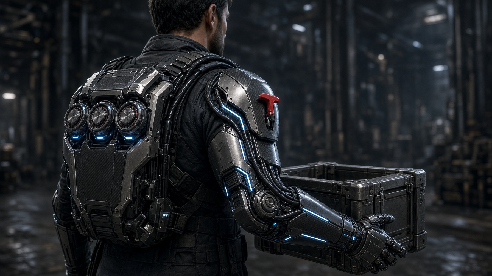
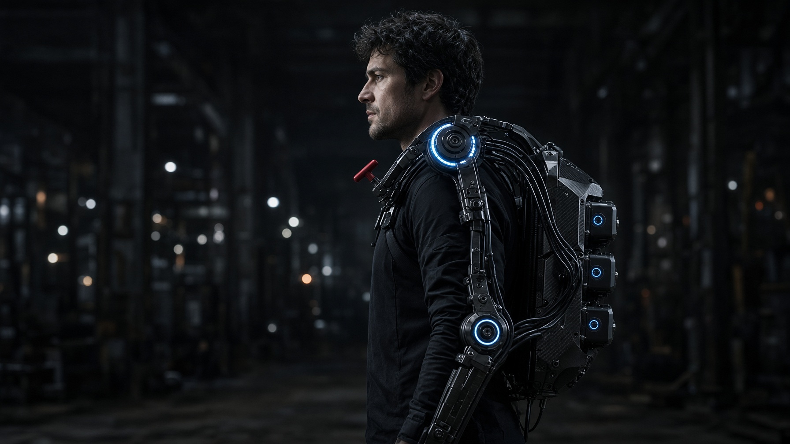
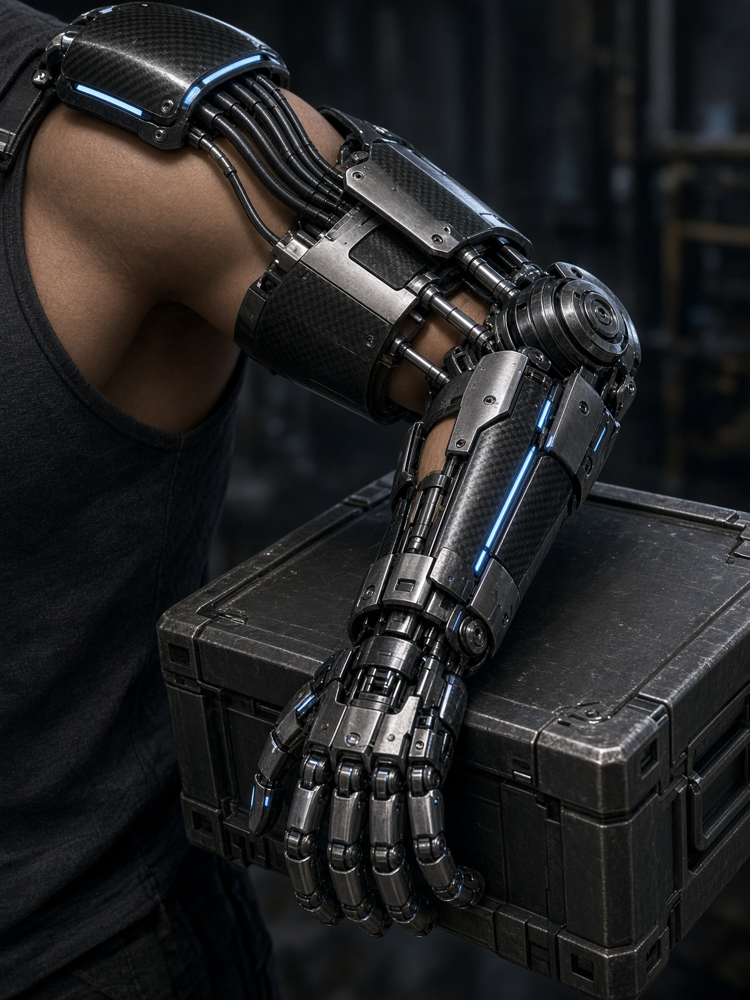
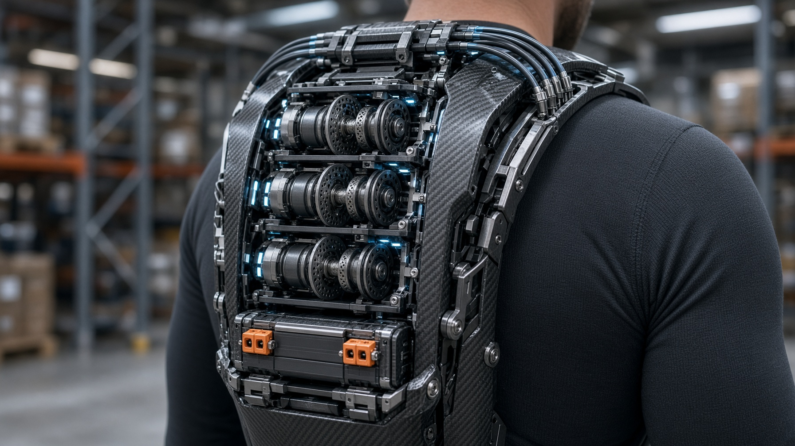
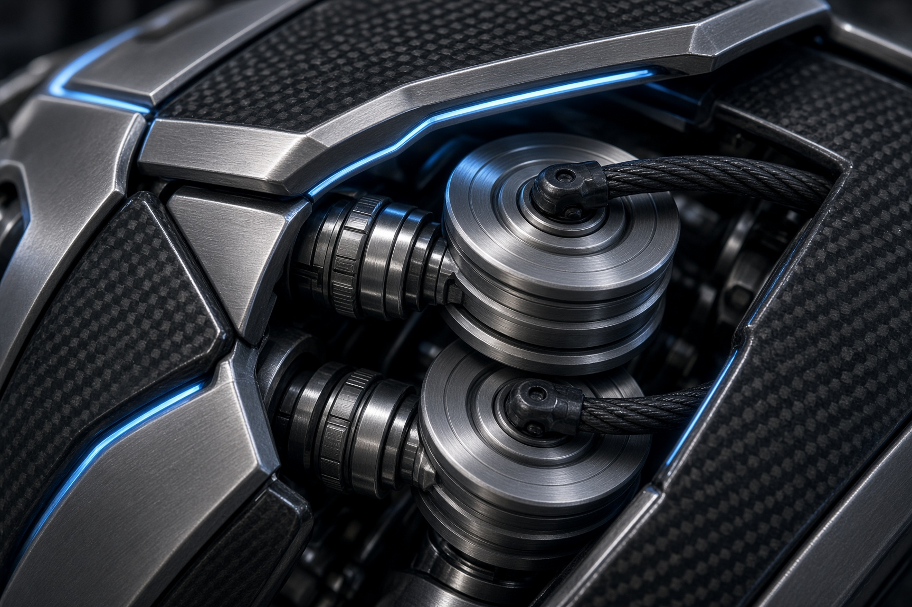
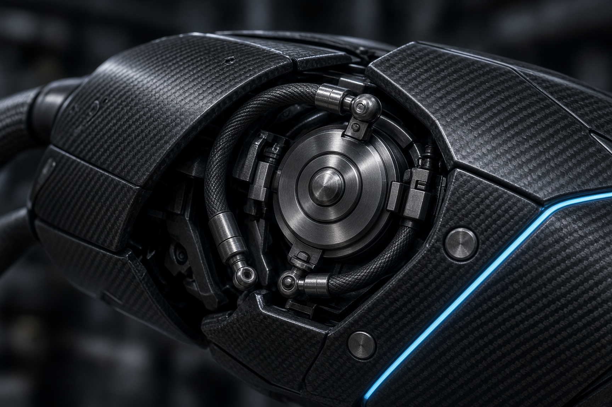
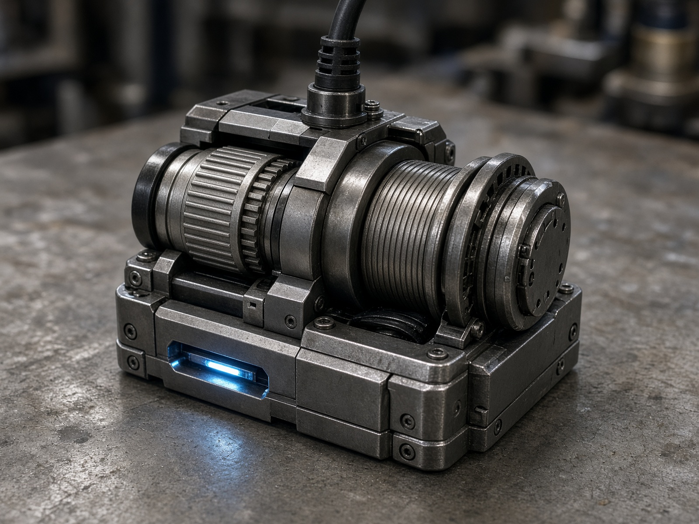
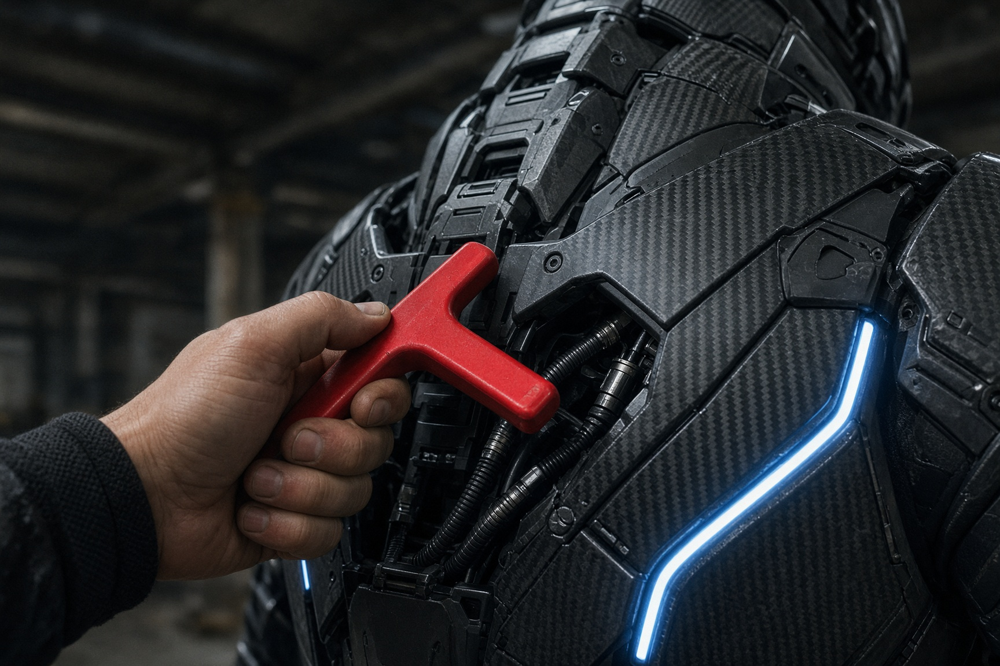

# CDX-3R

Cable-driven right-arm exoskeleton. **3R** = three revolute axes on the right arm (shoulder flexion, shoulder abduction, elbow flexion). Wrist plating is passive.



This repo is the design portal: architecture, physics, cable drive, motion clips, safety, gallery, cost, and sponsor kit.

> Concept design. Not a certified build. Structural analysis, e-stop testing, and battery safety review still required.

## The machine

Motors in the backpack. Bowden cables over the right shoulder. Three powered revolute joints. Left hand stays free for the T-handle.



| Operator view | Pack internals |
|---|---|
|  |  |

| Shoulder pulleys | Elbow antagonist |
|---|---|
|  |  |

| Bench winch | E-stop |
|---|---|
|  |  |

## Motion

These clips show the **two lift joints** turning under load. Not a walk-around.

**Coordinated 3R lift** — shoulder flexion, then elbow flexion. Crate from hip to chest. Wrist does not move.

<video src="https://github.com/meetsitaram/cdx-3r/raw/main/public/gallery/lift-3r.mp4" controls muted loop playsinline width="100%"></video>

[Play coordinated lift](https://github.com/meetsitaram/cdx-3r/raw/main/public/gallery/lift-3r.mp4)

**Shoulder flexion** — dual sheaves rotate, cables only pull.

<video src="https://github.com/meetsitaram/cdx-3r/raw/main/public/gallery/shoulder-motion.mp4" controls muted loop playsinline width="100%"></video>

[Play shoulder](https://github.com/meetsitaram/cdx-3r/raw/main/public/gallery/shoulder-motion.mp4)

**Elbow flexion** — antagonist pair wraps the pulley as the forearm closes.

<video src="https://github.com/meetsitaram/cdx-3r/raw/main/public/gallery/elbow-motion.mp4" controls muted loop playsinline width="100%"></video>

[Play elbow](https://github.com/meetsitaram/cdx-3r/raw/main/public/gallery/elbow-motion.mp4)

**Operator view** — looking down the arm as the crate comes up.

<video src="https://github.com/meetsitaram/cdx-3r/raw/main/public/gallery/lift.mp4" controls muted loop playsinline width="100%"></video>

[Play operator view](https://github.com/meetsitaram/cdx-3r/raw/main/public/gallery/lift.mp4)

## Kinematics

Not a 7-DOF industrial arm.

1. Shoulder flexion
2. Shoulder abduction
3. Elbow flexion

## CAD models

Printable plates and cuffs, McMaster sheaves/bearings, pack winches. Open **Build** on the site and tap **Load 3D** to orbit. GitHub itself does not play STLs.

**Full system** — pack on the back, right arm hanging. Saddle takes the exo weight, not the biceps.


**Right arm** — shoulder 2R on top, elbow sheave outboard of the cuffs.


**Elbow close** — Bowden housing down the upper arm, 608 fairleads, gold 3434T121 sheave.


Do not print `ref_*_DO_NOT_PRINT.stl`. Buy the McMaster parts.

Folders:

- [cad/README.md](cad/README.md) — order of work
- [cad/elbow/](cad/elbow/) — 3434T121 sheave, printable forks/cuffs
- [cad/shoulder/](cad/shoulder/) — flexion + abduction
- [cad/backpack/](cad/backpack/) — D6374 + 10:1 + 48 V brick
- [cad/system/](cad/system/) — saddle, yoke, UA beam, belt, cradle

## Run locally

```bash
npm install
npm run dev
```

Open [http://localhost:8080](http://localhost:8080).

```bash
npm run build
```

## Layout

| Path | What |
|---|---|
| `src/routes/index.tsx` | The site |
| `src/lib/cdx.ts` | Specs, gallery, BOM, cost tiers |
| `public/gallery/` | Stills and motion clips |
| `public/cad/` | STL + preview stills |
