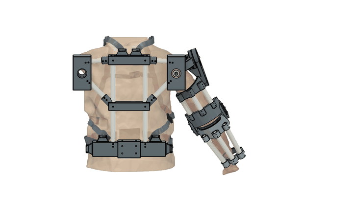
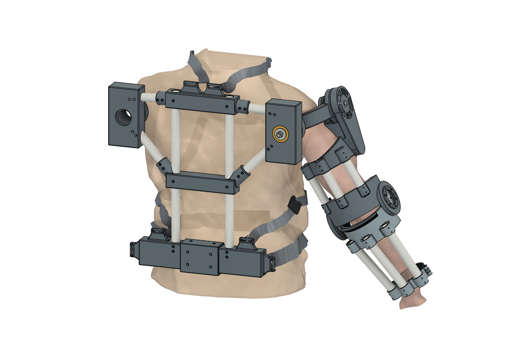
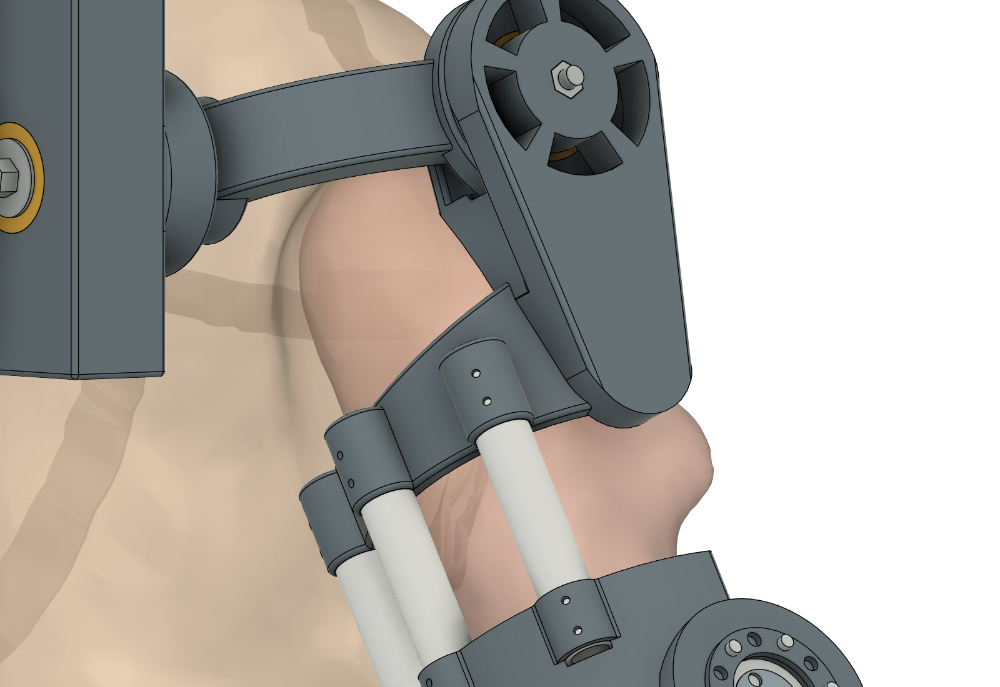
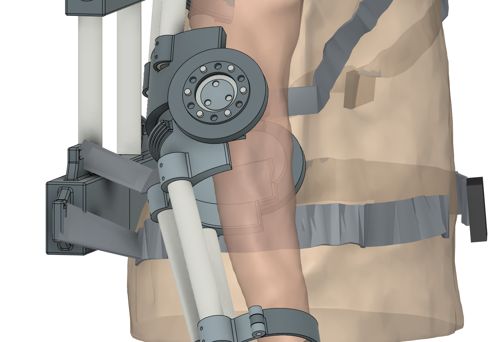
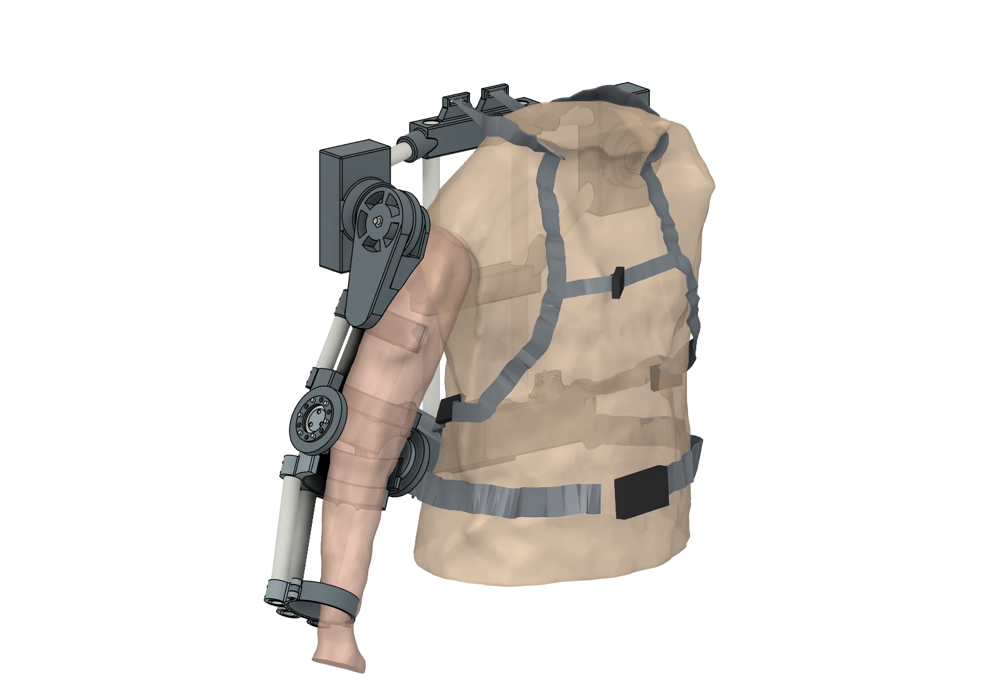

# CDX-3R

A right-arm exoskeleton made of 3D-printed parts, PVC pipe and off-the-shelf bearings, designed around a
3D scan of the wearer's body. **3R** = three revolute joints on the right arm: shoulder abduction, shoulder
flexion and elbow flexion.



*Elbow to 100 degrees, shoulder forward to 70 and out to 45, back to rest; the scanned arm moves with the exo. Rendered from the Fusion models. [Video](docs/images/cdx3r-motion.mp4)*

> Work in progress. The passive structure (frame, joints, harness) is designed and being test-printed;
> actuation (motors, cables, battery) is not designed yet. Not a certified device.

## How it works



**Back frame.** Two vertical PVC pipes (21.5 mm OD) form the backbone. They're held by printed top, mid and
bottom joints and braced to a mount block behind each shoulder by an upper beam and a diagonal, a triangulated
frame that carries the arm's loads into the back and the waist belt. The frame is symmetric (the left side is a
Fusion mirror of the right) so the weight sits centred. The left mount block is free for a battery or a future left arm.

**Harness.** Worn like a backpack: two shoulder straps, a sternum strap and a waist strap, all 1" webbing
with side-release buckles, through six printed strap tabs on the frame.



**Shoulder (2 joints).**
- *Abduction* (arm out to the side): a hinge behind the shoulder on 2 × 6806 bearings in the mount block,
  clamped by an M8 through-bolt. A curved yoke carries it round the back of the shoulder.
- *Flexion* (arm forward/back): a hinge on the outside of the shoulder on 2 × 6808 bearings in the yoke's
  Ø88 housing (the same size as the elbow hub).
- Both hinge axes pass through the shoulder joint's centre, so the exo moves with the arm instead of sliding on it.
- *Upper-arm link:* one printed piece: a fork round the flexion hinge (spoked, so the bearing shows), a
  Y-gusset and a pipe head that holds the three upper-arm pipes in blind sockets. It also acts as the
  backward stop at about -25 degrees.



**Elbow.** Upper-arm and forearm units are three rear PVC pipes each, joined at a two-sided hinge on
2 × 6806 bearings with bolted axles and spoked covers. Built-in stops at straight and 135 degrees flexion. Nothing
hard sits on the front of the arm near the elbow, so there's no biceps pinch. A hinged wrist ring with a cuff holds
the forearm.




## Fitted to a body scan

The wearer was captured as a Gaussian splat. `cad/scan/` turns it into a clean body mesh with landmarks
(shoulder joint centre, elbow, wrist). The layout and every part are checked against it: collisions,
clearance to the body at rest (the arm rests at 20 degrees abduction) and over the shoulder's range
(abduction 20–60 degrees, flexion -20 to 120 degrees), plus the elbow's 0–135 degree sweep.

## Build it

| What | Where |
|---|---|
| Parts to buy (bearings, screws, inserts, webbing), with links | [BOM.md](BOM.md) |
| Print files (Bambu P1S, PETG), orientation, assembly | [prints/shoulder-back-v2/](prints/shoulder-back-v2/) and [prints/elbow-test-v10/](prints/elbow-test-v10/) |
| Fusion models | [cad/fusion/models/](cad/fusion/models/) (`cdx-3r-shoulder-back.f3d`, `cdx-3r-elbow-concepts.f3d`) |
| Scripts that build the models | [cad/fusion/](cad/fusion/) (`shoulder.py`, `concepts.py`, `fxlib.py`) |
| Body-scan pipeline | [cad/scan/](cad/scan/) |
| Lessons learned (read before changing the design) | [cad/fusion/LESSONS.md](cad/fusion/LESSONS.md) |

## Not done yet

- Actuation: motors, cable drive, battery, controller.
- Wrist-cuff latch (a magnet-assisted snap latch is planned).
- Dedicated shoulder stop pads (abduction 60 degrees, flexion 120 degrees).

## Website

The design portal site lives in `src/`:

```bash
npm install
npm run dev     # http://localhost:8080
```
