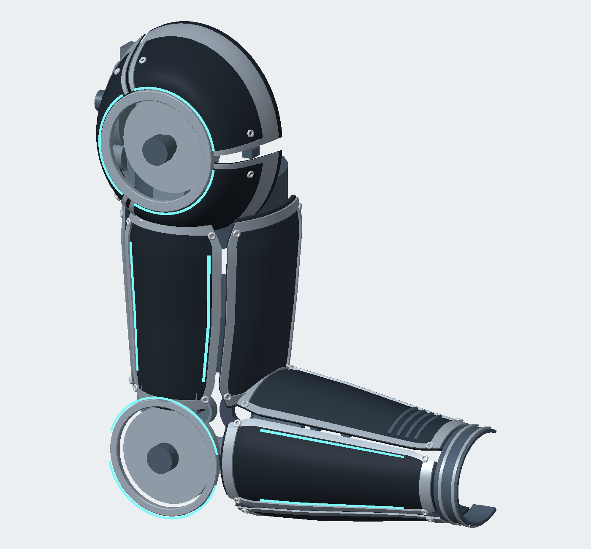

# Revision B — shoulder-to-forearm shells

The operator-view reference drives the panel coverage: a segmented shoulder cap, long tapered upper-arm and forearm panels, contrasting borders, narrow light strips, an open elbow joint, and a passive wrist collar.



The image is rendered directly from the exported STLs. It is not an AI-generated replacement for the CAD.

## Geometry and files

- Three separately closed shoulder panels surround the actual flexion axle. There is no duplicate cosmetic sheave stack.
- The main upper-arm panel spans 178 mm along the limb, increased from 108 mm. The forearm panel spans 201 mm, increased from 106 mm.
- Front and rear wings wrap around each limb with gaps between panels. Borders and light strips follow the same parametric surfaces.
- The main limb walls are 3.2 mm; the shoulder panels are 3.5 mm. The wrist collar is passive.
- Each primary panel has its own `print_fairing_*.stl`. `print_fairing_ua` and `print_fairing_fa` are center panels; `_front` and `_rear` are separate wings. `print_fairing_pack_tub` is now the left pack rail, with a separate right rail, crown, bridges and battery lid.
- Hardware heads, trim and lights are separate assembly layers. The visible fasteners are reference details; mounting holes, inserts, brackets and motion clearance still need a fabrication-detail pass.

Source: [build_stl.py](build_stl.py). Common dimensions: [params.json](../params.json) and [design.py](../design.py). Surface construction: [surfaces.py](../surfaces.py).

## Rebuild and inspect

From the repository root:

```bash
python -B cad/build.py
python -B -m unittest discover -s cad/tests -v
python -B cad/render_previews.py
```

Install the packages in `cad/requirements.txt` if needed. The outputs in `cad/*/stl` and `public/cad/*` are generated together, with matching manifests. The web viewer uses these manifests and retains a complete combined assembly if any colored layer fails to load.

The five CAD checks cover export synchronization and completeness, closed single-solid shell topology, pack envelope separation, joint/window alignment, and sleeve coverage/cuff clearance. They do not establish collision clearance through the full motion range or structural load capacity.

## Layout changes supporting the shells

Both flexion axes are parallel to world Z; the elbow is directly below the shoulder. The previous whole-elbow 45° yaw is removed. The abduction sheave and its mounting ring now use world X as their rotation axis.

The pack has three transverse winch bays at 90 mm spacing, controllers behind the motors, and a separate lower battery compartment. The existing compact battery envelope has been rotated to 220 × 76 × 52 mm. A specific battery part remains to be selected; the old Hailong purchase reference did not match that envelope.
