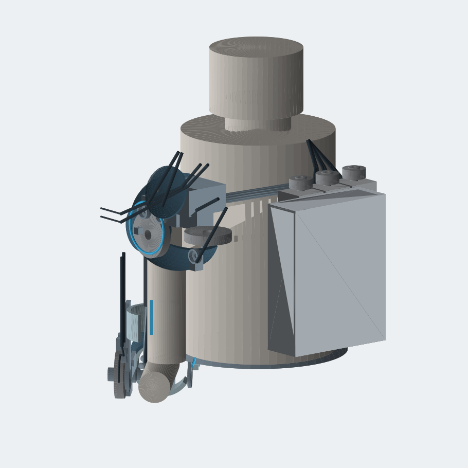
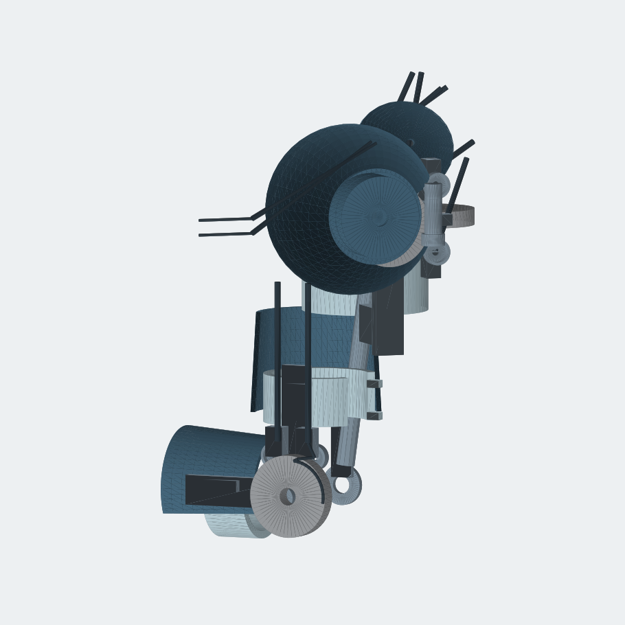
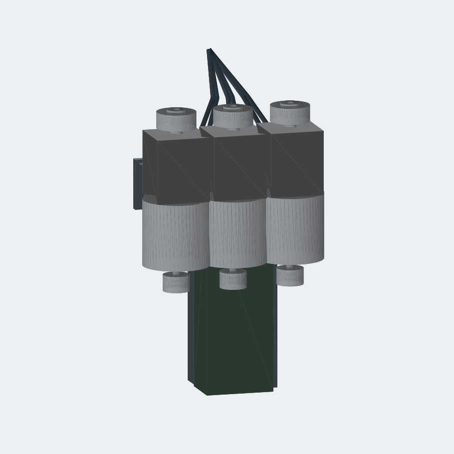

# CAD versus generated visuals

**Historical baseline, before Revision B.** The current implementation is described in [the shell revision](../armor/README.md). The saved measurements and images below intentionally show the earlier CAD.

Reviewed 2026-09-20. The current work provides a reusable component layout and early armor studies. A substantial pass on packaging, body-fitting surfaces, and assembly interfaces is still needed to resemble the generated imagery. Better materials and lighting will help presentation, but cannot supply the missing geometry.

This review compares the repository's generated stills with its current Python geometry and served STL layers. The new images below render existing geometry with neutral materials; they are not proposed redesigns. Views and poses differ from the concept images, so this is a qualitative design comparison, not a pixel similarity measurement. No mechanical dimensions or design geometry were changed for this review.

## What is already present

- Right-arm elbow hinge, cuff geometry, sheave and fastener references, cable anchors and fairleads.
- Shoulder flexion and abduction assemblies, upper-arm beam, saddle, yoke, hip belt and forearm rest.
- Three backpack winch envelopes, battery and controller envelopes, bulkhead and cable runs.
- Separate shoulder, upper-arm, forearm, scapula and backpack fairings, plus trim and light-strip placeholders.
- Editable procedural geometry and separate STL layers. This is useful starting material, although it is not a fully constrained solid assembly.

## How far the appearance is from the references

| Area | Generated reference | Current CAD | Work needed |
|---|---|---|---|
| Overall silhouette | Close-fitting armor with continuous visual transitions between shoulder, arm, wrist and pack | Sparse frame, short shell patches, cylindrical body stand-in and a rectangular backpack | Establish a fitted body envelope, coordinated joint centers and consistent proportions |
| Shoulder | Sculpted segmented cap with overlapping metal trim, recessed mechanism and integrated cable exits | Spherical window shell, simple rings and large block-shaped supports | Redesign cap profile, panel boundaries, trim and attachment interfaces around the actual shoulder mechanism |
| Upper arm / forearm | Long tapered panels, wraparound coverage, seams, ribs and layered joint transitions | Upper-arm shell spans 108 mm; forearm shell spans 106 mm along their local limb axes | Extend and shape the panel system, with deliberate elbow and wrist transitions; these lengths are not directly measurable from the generated images |
| Wrist / hand | Articulated-looking gauntlet and plated hand in the hero and operator views | No corresponding wrist/hand armor assembly found in the CAD generators | Add passive wrist/hand plating if that visual is in scope; keep it separate from the three powered axes |
| Backpack | Contoured shell, visible organized drive modules and a defined battery compartment | 220 × 280 × 80 mm rectangular frame; internal layout and decorative windows disagree | Resolve the physical component layout first, then design the cover around it |
| Cables / interfaces | Bundled curved runs, clamps, connectors, panel mounts and trim | Straight-segment tube approximations and scattered placeholder fittings | Model continuous routes, attachment points and service access in the same assembly coordinates |
| Finish | Carbon weave, metal edges, fasteners, blue lighting and controlled photographic lighting | Flat material colors and coarse preview lighting | Add rendering detail after the silhouette and interfaces are settled |

## Specific issues that affect the next revision

### The displayed and exported assemblies differ

The served per-part STL triangles match the current Python-generated geometry for all five kits. However:

- `cad/system/stl/assembly_worn.stl` has **38,180 triangles**, while `public/cad/system/assembly_worn.stl` has **52,060**. The local system assembly lacks the nine `ar_*` armor layers present in the served system.
- The web viewer's full-system layer list contains **32 of the 65 layers in the served manifest**. It removes the full gray fallback after the first colored layer loads. Yokes, bearings, fasteners, several cable runs and other components therefore disappear from the final colored view. Failed layer loads are also silently ignored.
- The system preview renderer explicitly excludes all armor layers from its `worn` view. The existing still is not an all-layer view.
- All five geometry generators and preview scripts use absolute `/workspace/public/cad/...` output paths, which do not point into this checkout.

Sources: [viewer](../../src/components/cdx/cad-viewer.tsx), [system generator](../system/build_stl.py), [system preview renderer](../system/render_previews.py).

### The backpack needs packaging work before surfacing

These measurements describe the repository's modeled envelopes, not independently verified commercial hardware:

- Motors are modeled at **75 mm diameter on 65 mm centers**. Adjacent parallel motor bodies overlap by 10 mm along their centerline.
- The central motor occupies the same space as the battery block: its body runs from Y=18 to 92 mm around X=0, Z=42 mm, inside the battery's Y=-125 to 95 mm range and overlapping its X/Z section.
- A placed winch extends to **Y=192.5 mm**, while the frame ends at **Y=140 mm**: 52.5 mm extends beyond the top of that frame.
- The modeled battery is **76 × 220 × 52 mm**, while the backpack README names a **367 × 90 × 111 mm** Hailong envelope. These are different packaging assumptions.
- The armor has three windows stacked along Y and facing outward along the pack's Z axis. The drive modules are placed side by side along X with their shafts along Y. The cover windows therefore do not expose the drive faces as the concept suggests.

Sources: [backpack geometry](../backpack/build_stl.py), [backpack README](../backpack/README.md), [armor geometry](../armor/build_stl.py).

### Armor and joints are still independent studies

The armor generator adds its own two coaxial shoulder sheaves at X=14, Y=10, while the mechanical shoulder flexion sheave is centered at X=0, Y=0. The system includes both. The cap and bezel should reference the real mechanism instead of adding another mechanism to achieve the appearance.

The shoulder source describes abduction about X, but builds that sheave with `rx(90)`, which rotates the cylinder's Z axis onto Y. That axis convention needs reconciliation before articulating the assembly.

The current generators place the assembly in fixed poses. This review did not perform a range-of-motion, cable travel, collision sweep, structural analysis or physical fit test.

### Some “print” meshes need topology repair

An edge audit of the generated armor meshes found:

| Mesh | Closed surface | Finding |
|---|---|---|
| Scapula fairing | No | 112 boundary edges |
| Backpack tub | No | 240 boundary edges |
| Upper-arm, forearm and deltoid fairings | Yes | Inconsistent triangle winding |
| Backpack lid and deltoid bezel | Yes | Edge closure and winding checks pass; this does not prove fit or that each export is one connected part |

`polar_plate()` creates inside and outside surfaces without closing the perimeter or window walls. Adding panels together with `Mesh.add()` also does not perform a solid union. The frame, for example, has 12 non-manifold edges after coincident vertices are merged.

See [audit results](audit.json). The saved JSON preserves the baseline measurements. Running `python cad/review/audit_cad.py` now audits the current normalized geometry into `audit-current.json`, using NumPy and trimesh. The inspection renders can be reproduced with `MPLCONFIGDIR=/tmp/cdx-review-mpl python cad/review/render_cad.py` using NumPy and Matplotlib. The audit imports generator functions without invoking their export routines.

## Reference decisions

The generated images do not describe one consistent machine:

- [Hero](../../public/gallery/hero.jpg): three prominent circular pack faces arranged across the upper back and extensive hand plating.
- [Pack detail](../../public/gallery/pack.jpg): three drive modules arranged vertically with a separate lower battery compartment.
- [Side](../../public/gallery/side.jpg): a much more exposed arm frame and another pack treatment.
- [Operator view](../../public/gallery/first-person.jpg): useful guidance for panel coverage, cable bundles, elbow transitions and the passive gauntlet.

Recommended starting interpretation: use the operator view for arm coverage and surface language, the pack detail for the pack's visual organization, and the hero for finish and overall character. The final pack layout must follow actual component envelopes; none of these images supplies reliable dimensions or proves mechanical feasibility.

## Concrete route to the next CAD revision

1. **Make one reproducible assembly.** Use checkout-relative output paths; synchronize local and served geometry; load the complete layer manifest; centralize wearer dimensions and joint transforms. Done when the local STL, web view and all-layer render show the same parts in the same pose.
2. **Resolve the physical layout.** Reconcile shoulder axes, remove duplicate cosmetic mechanisms and repack the motors, electronics and selected battery without overlap. Done when real component envelopes fit their allocated space and drive faces align with intended openings.
3. **Build the visible shell system.** Shape a shoulder cap, tapered upper-arm and forearm panels, passive wrist transition and contoured pack. Add consistent overlaps, borders and panel gaps around the mechanism. Done when neutral-material front, side and rear views reproduce the chosen reference's coverage and silhouette.
4. **Detail assembly and motion.** Add mounts, seams, fastener holes, cable guides and service access. Repair topology and inspect neutral, 90° elbow-flexion and raised-arm poses for interference. Done when the chosen clearances are demonstrated across the defined motion range.
5. **Finish presentation.** Add carbon/metal materials, restrained lighting accents and matched camera views. Review these against the chosen generated stills after geometry is settled.

The first useful modeling deliverable is a coherent, fully visible assembly with corrected packaging and a new shoulder-to-forearm shell pass. That will close more of the gap than polishing the existing preview images alone.
