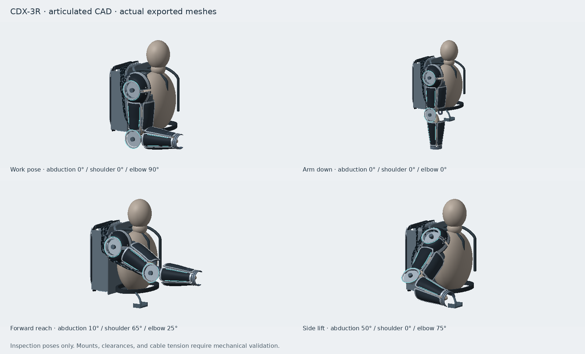

# CDX-3R system

Elbow + shoulder + backpack as **one structure**.

The exo does **not** hang on the arm.

```
  [pack] --yoke--> [SADDLE on trapezius]
                       |
                    UA beam (lateral)
                       |
                    elbow
                       |
                  PARK REST  (forearm sits here)
                       |
                    HIP BELT
```

- **Amber saddle** — rests on the shoulder. This is the rest position for the exo.
- **Yoke** — saddle load goes into the pack, then the hip belt.
- **Cuffs** — couple assist torque to the limb. They are not a hanger.
- **Red park rest** — forearm shelf in rest. You can take your arm out. The exo stays.

If the biceps are holding the suit, the load path is wrong.


## Revision B

The full assembly now includes every current shell and mechanism layer. The
shoulder and elbow use shared datums from `cad/design.py`; all exported views
use the same work pose. The elbow flexes forward without the former 45° yaw.
The pack has separated winch bays, rear controllers and a lower battery envelope.
The system harness replaces disconnected subsystem cable extensions.

See [shell revision and verification](../armor/README.md).

## Revision C — articulated inspection model

The portal's **Motion → Articulated assembly → Load 3D** view now moves the
actual CAD layers. It provides shoulder abduction, shoulder flexion and elbow
flexion sliders, four pose presets, a motion sequence, shell visibility, joint
axis arrows and a fit-view button. The same controls appear in the full system
viewer. Individual elbow/shoulder kit viewers remain static part inspections.



The 114 assembly layers contain the same 106,020 triangles as the previous
79-layer assembly. The additional layers separate upper-arm and forearm trim,
fasteners and lights, the two shoulder joints' fittings, the mannequin limbs,
and individual harness routes. Shell contours and print parts are unchanged.

### Joint convention

The source STLs stay in the work pose: upper arm down, forearm forward. The
exported `asm/colors.json` contains a `motion` block with joint hierarchy,
rest-world axle origins, axes, layer ownership and flexible routing weights.
`cad/motion.py` is the source of that contract. The Three.js viewer builds nested
joint groups from it; it does not infer a hinge from each mesh's bounding box.

| Joint | Parent | Positive direction | Inspection range | STL rest angle |
|---|---|---|---|---|
| Shoulder abduction | Torso/pack | Outboard, about −X | 0–60° | 0° |
| Shoulder flexion | Abduction yoke | Forward, about local +Z | 0–90° | 0° |
| Elbow flexion | Upper arm | Bend from extension, about local +Z | 0–135° | 90° |

The shoulder cap belongs to the abduction yoke. Upper-arm panels and their trim
follow shoulder flexion; forearm panels, cuff, distal plate and passive wrist
follow elbow flexion. The pack, straps, saddle and parking cradle stay fixed.
The body ghost is split so its two limb segments follow the same joints.

Flexible housings and collars blend between their fixed pack attachment and
moving joint attachment. Exposed cable shapes also deform for inspection.
This approximation does **not** preserve cable length, model tendon tension,
solve sheave contact, or verify bend radius. The ranges above are provisional
inspection ranges; they are not certified hard-stop limits or collision-free
motion envelopes. Visible fasteners still need mating mounts and holes.

### Verify and reproduce

```bash
python -B cad/build.py
python -B -m unittest discover -s cad/tests -v
pnpm run test:cad-motion
pnpm run typecheck
pnpm run build:dev
python -B cad/render_motion.py             # four-pose evidence sheet
python -B cad/render_motion.py --animate   # also generate a fixed-camera GIF
```

The nine Python checks cover the earlier geometry/export checks plus ownership,
rest-pose identity, joint closure and segment lengths, and routing endpoints.
Seven TypeScript checks exercise the actual Three.js hierarchy, combined angle
sweeps, shell visibility, malformed metadata, bounded inputs, and cable endpoints
without incremental-transform drift. These checks do not test physical loads
or prove surface collision clearance. There is no hardware-control connection.
