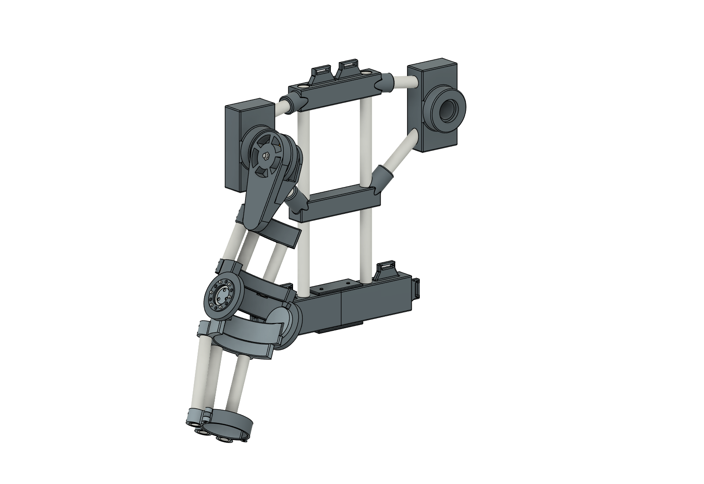
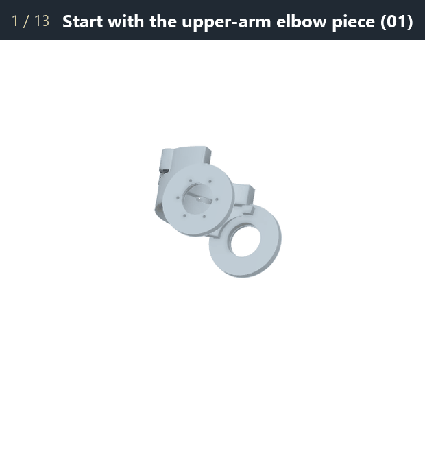
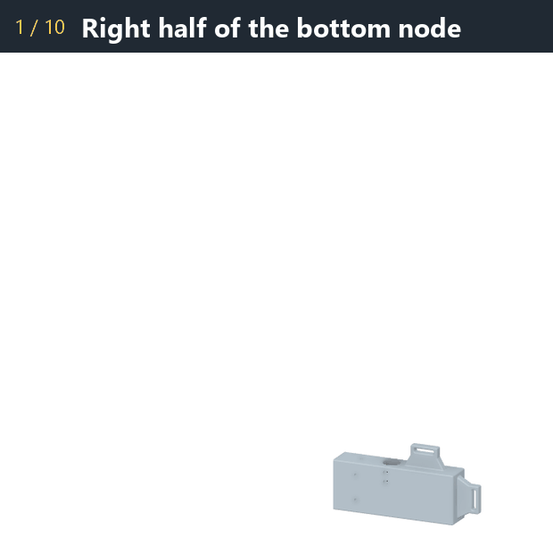
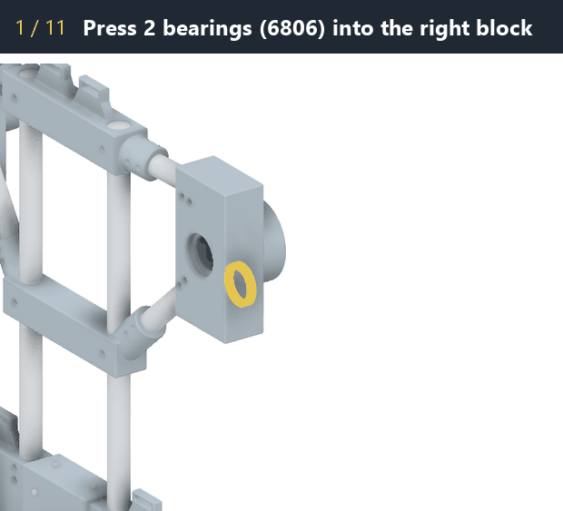
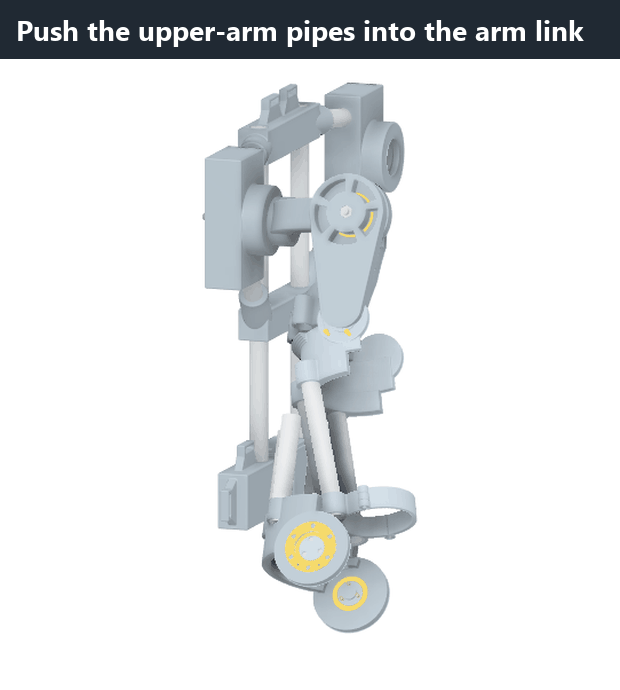
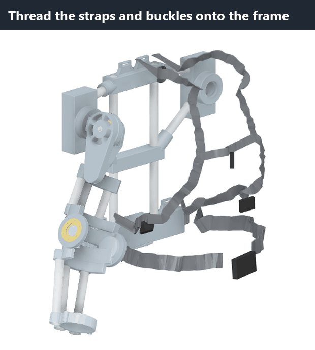

# How to build the CDX-3R arm exo

This guide walks you through building the exo one small step at a time. Every step has an animation that shows
exactly which part goes where. Watch it first, then do it.

**What you're building:** a backpack-style frame (the *back frame*) with a robot-arm shoulder on the right side. An
arm hangs from the shoulder with an elbow in the middle, and the whole thing is held on with straps. It has 3 joints
that move with your arm: the shoulder lifts your arm sideways, the shoulder swings your arm forward, and the elbow
bends.

**Time:** about 4–6 hours of building (after printing). Do it over a few days if you like. Each big step is a good
place to stop.

> **Grown-up needed** for two jobs: using the **soldering iron** (it gets hot enough to burn) and **cutting the
> PVC pipe** (saw). Everything else you can do yourself.

## Contents

0. [Get ready](#0-get-ready): parts, tools, and 4 skills to practice
1. [Build the elbow](#1-build-the-elbow)
2. [Build the back frame](#2-build-the-back-frame)
3. [Build the shoulder](#3-build-the-shoulder)
4. [Join the arm to the shoulder](#4-join-the-arm-to-the-shoulder)
5. [Add the straps](#5-add-the-straps)
6. [Try it on](#6-try-it-on)

---

## 0. Get ready

### Printed parts

Print everything in PETG. The files are in two folders. Write the **number or name** on each part with a marker as
soon as it comes off the printer, so you don't mix them up.

**Elbow** ([prints/elbow-test-v10](../prints/elbow-test-v10/)):

| ☐ | Part | File |
|---|---|---|
| ☐ | Fit test pieces (print these first!) | `00_fit_coupon_bearing_pockets`, `00_fit_coupon_pipe_holes` |
| ☐ | **01** upper-arm elbow piece | `01_upper_arm_elbow_piece` |
| ☐ | **02** forearm elbow piece | `02_forearm_elbow_piece` |
| ☐ | **03** bearing axle × 2 | `03_bearing_axle_print2` |
| ☐ | **04** round cover × 2 | `04_bearing_cover_print2` |
| ☐ | **05** wrist ring | `05_wrist_ring` |
| ☐ | **06** wrist cuff | `06_wrist_cuff` |

**Shoulder and back** ([prints/shoulder-back-v2](../prints/shoulder-back-v2/)):

| ☐ | Part | File |
|---|---|---|
| ☐ | Bottom node, left half and right half | `Bottom_node_L`, `Bottom_node_R` |
| ☐ | Splice plate | `Bottom_node_splice_plate` |
| ☐ | Middle node | `Mid_node` |
| ☐ | Top node | `Top_node` |
| ☐ | Shoulder blocks, left and right | `Abduction_mount_block_L`, `Abduction_mount_block_R` |
| ☐ | Abduction sleeve (short tube) | `Abduction_sleeve` |
| ☐ | Yoke (the curved arm that goes around your shoulder) | `Yoke` |
| ☐ | Flexion sleeve (wide ring) | `Flexion_axle_sleeve` |
| ☐ | Arm link (the big part with the spoked wheel) | `Upper-arm_link` |

### Bought parts

Links are in [BOM.md](../BOM.md). Put the small parts in separate cups or bags and label them.

| ☐ | Part | How many | What it looks like |
|---|---|---|---|
| ☐ | **6806** bearing (30 mm hole) | 4 | thin steel ring that spins |
| ☐ | **6808** bearing (40 mm hole) | 2 | a slightly bigger ring |
| ☐ | Brass heat-set **insert**, M3 | 26 | tiny brass barrel with ridges |
| ☐ | **M3 × 8** screw (small, hex head) | 26 | small screw, 8 mm long |
| ☐ | **Pipe screw**, #4 × 3/8" (pointed, cross head) | 48 | short pointy screw |
| ☐ | **M8 × 100** bolt (long) | 1 | 10 cm long bolt |
| ☐ | **M8 × 55** bolt (medium) | 1 | 5.5 cm long bolt |
| ☐ | M8 **lock nut** (has a plastic ring inside) | 2 | |
| ☐ | M8 **big washer** (30 mm wide) | 1 | |
| ☐ | **Pin**, 4 mm × 25 mm | 1 | small steel rod |
| ☐ | **PVC pipe**, 21.5 mm outside (½" pipe) | about 2.5 m | |
| ☐ | 1" strap kit (straps, buckles, sliders) | 1 kit | |

### Tools

- soldering iron (any cheap one works; a cone-shaped tip is best)
- hex keys (Allen keys): **2.5 mm** and **6 mm**
- wrench or socket, **13 mm**
- small cross-head screwdriver (Phillips #1)
- saw for the pipe (a hacksaw, or a PVC pipe cutter, which is easier)
- sandpaper
- tape measure or ruler **with millimetres**, and a marker
- super glue (a tiny drop)

### Skill 1: Cutting PVC pipe

1. Measure from the end of the pipe with the **millimetre** side of the ruler and make a mark.
2. Wrap a piece of tape around the pipe right at the mark so you have a straight line to follow.
3. Cut along the tape. Try to keep the cut square, not slanted.
4. Sand off the rough bits (inside and outside the cut) so the pipe slides in smoothly.
5. Write the name of the piece on it.

You'll cut 12 pieces in total. Each step tells you which pieces to cut, right when you need them. Here's the full list
in case you'd rather cut them all at once:

| Piece | Length | How many | Used in |
|---|---|---|---|
| Forearm pipe | **184.8 mm** (7.28 in) | 3 | step 1 |
| Upper-arm pipe | **127.5 mm** (5.02 in) | 3 | step 1 |
| Backbone | **412 mm** (16.22 in) | 2 | step 2 |
| Short beam | **101.6 mm** (4.00 in) | 2 | step 2 |
| Diagonal | **130.6 mm** (5.14 in) | 2 | step 2 |

That's about 2.2 m of pipe, so 2.5–3 m gives you room for a mistake.

### Skill 2: Melting in a brass insert *(grown-up helps)*

The printed plastic is too soft to hold a screw thread, so you melt a brass insert into it first.

1. Heat the soldering iron to about **225 °C**.
2. Set the insert on top of its hole, narrow end down.
3. Touch the hot tip into the insert and let it sink in **slowly** by itself. Don't push hard.
4. Stop when the top of the insert is **flush** (level) with the plastic. Not deeper.
5. Pull the iron straight up. Let it cool for a minute before you touch it.

Practice on a fit-test piece first!

### Skill 3: Pressing in a bearing

1. Line the bearing up **square** over its pocket.
2. Press it in with your thumbs, pushing on the **outer ring**. If it's tight, put a flat piece of wood on top and
   push with the palm of your hand.
3. It's in when it's flat and doesn't stick up anywhere.

Never hit a bearing with a hammer. Never push on the inner ring when you're pressing the outer ring in.

### Skill 4: Driving a pipe screw

1. Push the pipe all the way into its socket.
2. Put a pipe screw in the small hole and turn it with the screwdriver, so it cuts its own path into the pipe.
3. **Stop as soon as it's snug.** If you keep going, it strips the pipe and won't hold.

Every pipe end that goes into a socket gets **2 pipe screws**.

### First: the fit test

Before printing the big parts, check the two fit-test pieces:

- A **6806 bearing** should press into the test pocket with firm thumb pressure, and stay in.
- A piece of **PVC pipe** should slide into the test hole snugly, with no wobble.

If either one is too loose or too tight, stop and fix the printer settings before you print the big parts.

---

## 1. Build the elbow

**You need:** parts 01–06, 2 × 6806 bearings, 18 inserts, 18 M3 × 8 screws, 18 pipe screws, the 4 mm pin.

**Cut now:** 3 × **forearm pipe, 184.8 mm**, and 3 × **upper-arm pipe, 127.5 mm**.

1. Lay out the **upper-arm elbow piece (01)**.
2. Melt **6 inserts** into the holes around each round bearing hole, on both sides (12 in total). *(Skill 2)*
3. Press a **6806 bearing** into each round hole, from the inside. *(Skill 3)*
4. Slide the **forearm elbow piece (02)** in between the two sides of 01, so its round hubs line up with the
   bearings.
5. Melt **3 inserts** into each forearm hub (6 in total).
6. From the outside, push an **axle (03)** through each bearing until it sits in the hub.
7. Screw each axle down with **3 M3 × 8 screws** (2.5 mm hex key). Snug, not super tight.
8. Put a **round cover (04)** on each side.
9. Screw each cover down with **6 M3 × 8 screws**.
10. Push the 3 **forearm pipes (184.8 mm)** into the bottom of the elbow. Drive 2 pipe screws into each. *(Skill 4)*
    The pipes lean in a little toward the wrist. That's on purpose.
11. Slide the **wrist ring (05)** onto the other ends of the forearm pipes. Drive 2 pipe screws into each.
12. Put the **wrist cuff (06)** on the wrist ring, line up the little hinge bumps, and push the **4 mm pin**
    through them. Add a tiny drop of super glue at one end so the pin can't slide out.
13. Push the 3 **upper-arm pipes (127.5 mm)** into the top of the elbow. Drive 2 pipe screws into each.

**✔ Check:** Bend the elbow. It should swing smoothly from straight to a deep bend (135°) and stop by itself at
both ends. Nothing should scrape.

**Note:** The wrist cuff's latch isn't finished yet. For now, hold the cuff closed with a strap.

---

## 2. Build the back frame

**You need:** bottom node L + R, splice plate, middle node, top node, both shoulder blocks, 8 inserts, 8 M3 × 8
screws, 24 pipe screws.

**Cut now:** 2 × **backbone, 412 mm**, 2 × **short beam, 101.6 mm**, 2 × **diagonal, 130.6 mm**.

1. Take the **right half** of the bottom node.
2. Put the **left half** next to it.
3. Melt **4 inserts** into each half (8 in total).
4. Lay the **splice plate** over the joint, so it wraps the back, top and bottom.
5. Screw it together with **8 M3 × 8 screws**.
6. Push the 2 **backbones (412 mm)** into the sockets on top of the bottom node. 2 pipe screws each.
7. Slide the **middle node** down over both backbones to its spot. 1 pipe screw per pipe.
8. Push the **top node** onto the top ends of the backbones. 1 pipe screw per pipe.
9. Push the **short beams (101.6 mm)** into the sides of the top node, and the **diagonals (130.6 mm)** into the
   sides of the middle node. 2 pipe screws each.
10. Push the **shoulder blocks** onto the outer ends of the beams and diagonals, left and right. 2 pipe screws per
    pipe end.

**✔ Check:** Lift the frame by the top and give it a shake. It should feel stiff, with no loose pipes.

---

## 3. Build the shoulder

**You need:** the frame from step 2, yoke, abduction sleeve, flexion sleeve, arm link, 2 × 6806 bearings,
2 × 6808 bearings, M8 × 100 bolt, M8 × 55 bolt, 2 lock nuts, the big washer.

**Part A: the "lift sideways" hinge** (on the right shoulder block)

1. Press a **6806 bearing** into the front pocket and another into the back pocket of the **right shoulder block**.
2. Push the **abduction sleeve** (short tube) through both bearings.
3. Hold the round end of the **yoke** against the front bearing.
4. Push the **long bolt (M8 × 100)** through the yoke, the sleeve, and out the back.
5. Put the **big washer** on the bolt behind the block.
6. Screw on a **lock nut**. Hold the bolt with the 6 mm hex key and tighten the nut with the 13 mm wrench until it's
   firm.

**✔ Check:** The yoke swings up and down smoothly, and doesn't wiggle front-to-back.

**Part B: the "swing forward" hinge** (at the end of the yoke)

7. Press a **6808 bearing** (the bigger one) into each side of the round end of the yoke.
8. Push the **flexion sleeve** (wide ring) through both bearings.
9. Drop the second **lock nut** into the 6-sided pocket in the spoked side of the **arm link**. It fits only one
   way and can't turn.
10. Slide the arm link's two sides over the round end of the yoke.
11. Push the **medium bolt (M8 × 55)** in from the other side and tighten it into the nut with the 6 mm hex key.

**✔ Check:** The arm link swings forward and back smoothly. There's a small gap (about 2 mm, the thickness of 2
coins) between the link and the yoke on both sides.

> **Heads up:** a stronger version of the yoke and shoulder blocks is coming (see
> [the extension notes](extensions/shoulder-girdle-dof.md)). If you printed the new version, the steps are the same.

---

## 4. Join the arm to the shoulder

**You need:** the elbow from step 1, the frame + shoulder from step 3, 6 pipe screws. No cutting.

1. Push the top ends of the 3 **upper-arm pipes** into the 3 holes in the bottom of the **arm link**, all the way
   in.
2. Drive **2 pipe screws** into each pipe.

**✔ Check:** Move the arm around slowly:

- lift it out to the side: it should go from about 20° to 60°;
- swing it forward and up: almost straight up (120°), and a little backward;
- bend the elbow: straight to 135°.

Nothing should rub or get stuck.

---

## 5. Add the straps

**You need:** the 1" strap kit (straps, 2 buckles, sliders).

1. **Shoulder straps (2):** tie each strap to a tab on the top node. Bring it over your shoulder, down your chest,
   under your arm, and back to the tab on the bottom node on the same side. Put a slider on it so you can adjust the
   length.
2. **Chest strap:** connect the two shoulder straps across your chest, with a buckle in the middle.
3. **Waist strap:** thread it through the two side tabs on the bottom node, and buckle it in front.
4. *Optional:* slide soft pads (from a backpack or car seat) onto the shoulder straps and waist strap.

---

## 6. Try it on

Get a helper for the first time.

1. Put it on like a backpack: shoulder straps first, then the waist strap, then the chest strap.
2. Tighten the **waist strap** most. The weight should sit on your **hips**, not hang from your shoulders.
3. Put your forearm through the **wrist ring** and close the **wrist cuff**. The arm link should sit at the back and
   outside of your upper arm.
4. Move **slowly**: lift your arm, swing it forward, bend your elbow. If something presses or pinches, stop and note
   where. Small changes in strap length usually fix it.
5. After the first time you wear it, check that the two M8 nuts and all the pipe screws are still tight.

You built an exo!
